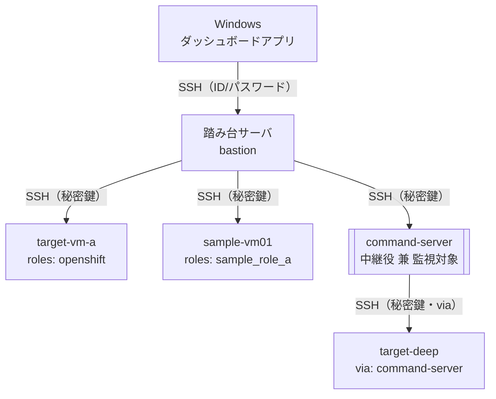

# infra-status-dashboard

Windows上で、企業内承認済みのPython実行環境を使って動作するサーバアプリケーションから、
踏み台サーバ経由でLinux/Kubernetes/OpenShift環境の稼働状態を確認できるダッシュボード。

未署名・不明なexeファイルの実行はEDR/アプリケーションホワイトリスト等でブロックされる
可能性があるため、単体の実行ファイルは作成せず、承認済みのPythonインタプリタで
スクリプトを実行する構成を採用している。

詳細な要件・設計は以下を参照。

- [files/requirements.md](files/requirements.md)
- [files/config_design.md](files/config_design.md)
- [files/development_plan.md](files/development_plan.md)

## アーキテクチャ

Windows上のアプリから踏み台サーバへSSH接続し、踏み台から各対象サーバへ多段SSH接続する。
対象サーバの中には、踏み台から直接ではなく別の対象サーバ（コマンド実行用VM等）を
経由しないと到達できないものもあり、`targets[].via`で経由先を指定する
（詳細は[files/config_design.md](files/config_design.md)参照）。



## セットアップ（Windows / 実運用）

1. Python 3.13をインストールする（承認済み実行環境）。
2. 設定ファイルを用意する。

   ```
   cp config.yaml.example config.yaml
   cp secrets.yaml.example secrets.yaml
   ```

   `config.yaml` は環境・ロール・チェック内容などの定義（Git管理対象）、
   `secrets.yaml` は踏み台のパスワードや秘密鍵パスなどの認証情報
   （`.gitignore`によりGit管理対象外）。内容は環境に合わせて書き換える。
   秘密鍵ファイルは`keys/`配下に配置する（同じく`.gitignore`で除外）。

   `bastion.host`・`targets[].host`は、短縮ホスト名だと環境のDNS設定次第で
   名前解決に失敗することがあるため、FQDN（ドメインまで含めた名前）か
   IPアドレスを指定すること。

   **config.yamlとsecrets.yamlの対応関係**（名前を変更する際は両方を揃えること）：

   | config.yaml側 | secrets.yaml側 | 対応関係 |
   |---|---|---|
   | `environments[].name` | `environments`直下のキー | 環境名として一致させる |
   | `environments[].targets[].name` | 各環境の`targets`直下のキー | 対象サーバ名として一致させる |

   `environments[].name`や`targets[].name`を実環境に合わせて変更した場合、
   `secrets.yaml`側の対応するキーも同じ名前に変更しないと、起動時に
   「secrets.yamlに認証情報がありません」というエラーになる。この対応関係の
   誤りやロール・チェック定義の参照ミスは、`python run.py`の起動時に
   まとめて検証され、問題箇所が具体的に表示される。

3. 仮想環境を作成し、依存パッケージをインストールする。

   ```
   python -m venv .venv
   .venv\Scripts\activate
   pip install -r requirements.txt
   ```

   社内プロキシ配下の環境では、pipがWindowsのプロキシ設定を自動認識せず
   `SSL: UNEXPECTED_EOF_WHILE_READING`等でインストールに失敗することがある。
   その場合は`HTTP_PROXY`/`HTTPS_PROXY`環境変数を明示的に設定してから実行する。

   ```
   set HTTP_PROXY=http://proxy.example.local:8080
   set HTTPS_PROXY=http://proxy.example.local:8080
   pip install -r requirements.txt
   ```

4. サーバを起動する。

   ```
   python run.py
   ```

   デフォルトでは `./config.yaml` / `./secrets.yaml` を読み込み、
   `config.yaml`の`web.listen_addr`（例: `:18080`）で待ち受ける。
   ブラウザで `http://localhost:18080/` を開くとダッシュボードが表示される。
   （8080番はすでに使用されている環境が多いため、既定値は18080番にしている。
   別のポートが使いたい場合は`config.yaml`の`web.listen_addr`を書き換える）

`start.bat`をダブルクリックすると、初回は`.venv`の作成・依存パッケージのインストールを
自動で行い、以降は`.venv`を有効化した上で`run.py`を起動する。

## Dockerでの動作確認

社内承認済みのWindows実機がまだ用意できない場合、`Dockerfile`を使うことで
「requirements.txtに書かれた依存関係だけでクリーンな環境から起動できるか」を
確認できる。本番の配布方式は上記のPython venv + `start.bat`であり、
このDockerfileはあくまで動作確認用（exe化の代替ではない）。

```
docker build -t infra-status-dashboard .
docker run --rm -p 18080:18080 ^
  -v C:\path\to\config.yaml:/app/config.yaml ^
  -v C:\path\to\secrets.yaml:/app/secrets.yaml ^
  -v C:\path\to\keys:/app/keys ^
  infra-status-dashboard
```

`secrets.yaml`内の`private_key_path`は、コンテナ内から見えるパス
（上記例なら`/app/keys/...`）に合わせて書き換えること。

開発中の踏み台・対象サーバの動作確認には、`linuxserver/openssh-server`イメージで
テスト用の踏み台・対象VMコンテナを個別に用意し、同じDockerネットワークに参加させる
ことでSSH多段接続を含めて検証できる（`test-bastion` / `target-vm`はこの用途で
作成したローカル検証用コンテナで、リポジトリの一部ではない）。
